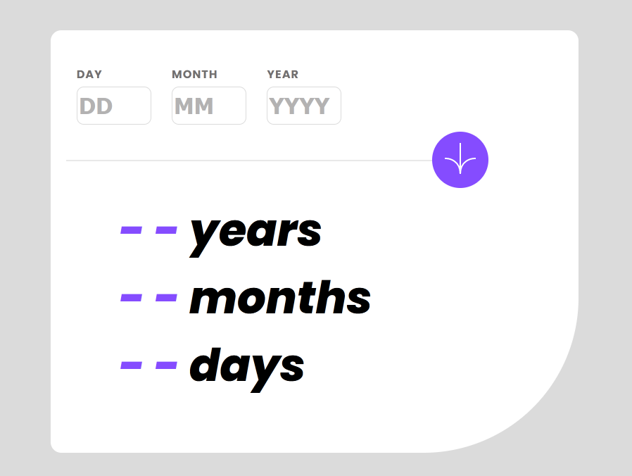

# Frontend Mentor - Age calculator app

## Welcome! 👋

This challenge really exposed my weaknesses, notably Javascript. Nonetheless it was a very good experience and fun (although stressful) to do!

After some quick testing, the app does the following:
- Displays the age for any valid birth date.
- Displays relevant errors.
- Animates the age output.

### The HTML/CSS side was straightforward, but the JS was pretty hectic for me and I admittedly needed to do alot of googling, but here are the condensed steps that led to me completing the script:

    #### Starting Off When the Page Loads:
        I made sure our JavaScript kicks in only after the whole webpage is loaded. This way, everything is in place before our code starts doing its thing.

    #### Setting Up the Essentials:
        I set up some variables for all the bits and pieces we need to keep track of, like the input fields for the day, month, and year, where to show errors, and where the age will pop up.

    #### Helpful Little Tools:
        I wrote a small function to check if something's a number – super handy for making sure dates are legit.
        There are also a couple of functions to make things look pretty (or not) depending on whether there are mistakes in the date someone puts in.

    #### The Birthday Math:
        I crafted a function that figures out how old someone is down to the day. It’s pretty neat, handling all those tricky bits like leap years and months with different numbers of days.

    #### Showing the Age:
        I also set up a way to display that calculated age right on the webpage in a really clear way.

    #### Making Sure the Date Makes Sense:
        The main event is this function that checks the date someone enters. It’s looking for any blanks or weird inputs, and making sure the date isn’t something impossible (like being in the future).

    #### Handling the Form Submission:
        Instead of the usual form submission, I made it so when you hit submit, it runs our date check first. This way, we only get to the fancy age showing part if all the date stuff is correct.
